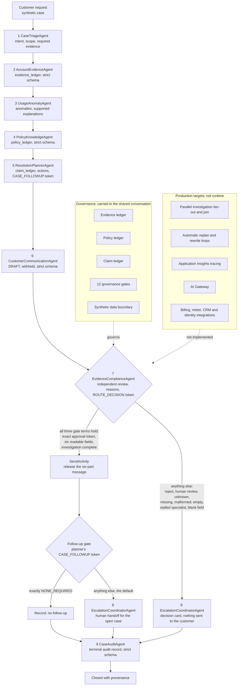

# Architecture

Platform: Microsoft Foundry. Project `[FOUNDRY_PROJECT_REDACTED]`, resource `[FOUNDRY_RESOURCE_REDACTED]`, West US 3, S0.
Model: `gpt-5-mini` (Global Standard, 50K TPM) on all nine agents, reasoning effort low. Embedding deployment `text-embedding-3-large` exists but is not used at runtime.
Orchestration: `GridResolveAIWorkflow` **v10**, Foundry Workflows Preview, declarative YAML.
External tools: none. All nine agents run with an empty tool list.
Status: a runtime-demonstrated, production-oriented prototype. This flow executed end to end in the hosted service on 2026-09-20. See `06_RUNTIME_PROOF.md`.

## Runtime flow (as deployed)



The final run took the path Triage, Evidence, Usage, Policy, Planner, Communication, Compliance, release, human handoff, Audit. The fail-closed path on the right was taken in run 2, on v9.

Steps 1 through 7 run with `autoSend: false`. Their output is captured into workflow variables and is not emitted to the user. Only three things can reach the user: the approved message, released by `SendActivity` on the approved branch, the escalation agent's response on either human route, and the terminal audit record.

## How each agent is invoked

Every agent node passes a short, literal input message: `WORKFLOW STEP n of 9: <AgentName>`, a statement that the assistant messages above were written by other agents, the task, what to read, the output required, and that no operator is present. None states a finding or an expected outcome.

This exists because of a defect the first two runs exposed. Through v9 each node passed an empty input on a shared conversation, so every agent after the first saw a conversation that ended in another agent's assistant turn and no new instruction. Three of seventeen invocations stopped without working. The cause was read from the platform's own record of what each agent received. See `docs/V10_CORRECTIONS_2026-09-20.md`.

## The fail-closed gate

```yaml
- kind: ConditionGroup
  conditions:
    - condition: =And(<compliance token term>, <six readable fields>, <investigation complete>)
      actions:
        - kind: SendActivity            # six customer fields as a {...} template
        - kind: ConditionGroup          # the follow-up gate, see above
    - condition: "true"
      actions:
        - kind: InvokeAzureAgent
          agent: {name: EscalationCoordinatorAgent}
```

Escalation is the default branch. Release is the exception, and all three terms must hold:

1. **The compliance token.** The text of the last compliance message must end with the approval token, exactly once, in exact case, alone on the final line, with no escalation token anywhere. EvidenceComplianceAgent emits it only when its decision is exactly APPROVE. This term is byte-identical to the v6 gate.
2. **A readable message.** Each of the six customer fields must hold something other than spaces, tabs, carriage returns and line feeds.
3. **A complete investigation.** The evidence, usage, policy and compliance outputs must each begin a JSON object and contain their key field. A specialist that returns a sentence instead of its work now sends the case to a human.

A missing token, a malformed response, an unknown decision, an empty result, a blank field or a stalled specialist all fall through to escalation.

History of this gate: the v4 condition `=Not("APPROVE" in Local.Var1497)` searched the whole compliance output for a substring, and Power Fx matches regardless of case, so under a local text-only model it skips escalation on 5 of 11 mocked outputs. The real Power Fx engine then showed that v4 and v5 do not compile at all, because the variable is a table of message records. v6 reads the message text and is correct on 24 of 24 adversarial outputs. v7 changed the release from an `=expression`, which the hosted service sent as literal text in run 1, to a `{...}` template. v8 released six fields instead of raw JSON and added the follow-up gate. v9 added the white-space guard. v10 added the third term and the input messages. `dotnet run --project tests/powerfx_gate` reproduces 105 cases on Microsoft's engine.

## Shared case state

One conversation flows through every agent. Each agent preserves `case_id` and `workflow_version`, advances `case_state`, and adds its own contribution without discarding upstream output.

| Ledger | Owner | Contents |
|---|---|---|
| `evidence_ledger` | AccountEvidenceAgent | evidence_id, source_type, source_record_id, period, field, value, observation, source_timestamp, data_version |
| `policy_ledger` | PolicyKnowledgeAgent | policy_id, policy_version, section, rule, applies_to, effect_on_resolution |
| `claim_ledger` | ResolutionPlannerAgent | each material claim with the evidence_ids and policy_ids supporting it |

In the final run the evidence ledger held 22 entries and the policy ledger nine policies.

`case_state` values: INTAKE, INVESTIGATING, PLANNING, DRAFTING, COMPLIANCE_REVIEW, CORRECTION, HUMAN_REVIEW, APPROVED, CLOSED, CANNOT_RESOLVE_SAFELY.

Four agents return strict `json_schema` output, so they cannot return a sentence in place of their object: AccountEvidenceAgent, PolicyKnowledgeAgent, CustomerCommunicationAgent and CaseAuditAgent. The planner and the compliance agent stay free text because each must end with a token line after its JSON. The gate's third term covers compliance.

## Agent roster

Versions as observed by the platform in the final run.

| # | Agent | Version | Responsibility | Must never |
|---|---|---|---|---|
| 1 | CaseTriageAgent | 5 | Classify intent, scope, required evidence, risk flags | Infer root cause |
| 2 | AccountEvidenceAgent | 9 | Inspect supplied records, issue evidence IDs | Interpret policy |
| 3 | UsageAnomalyAgent | 4 | Usage patterns, supported vs unsupported hypotheses | Assert a cause without evidence |
| 4 | PolicyKnowledgeAgent | 6 | Applicable policy, conflicts, approval requirements | Invent a policy |
| 5 | ResolutionPlannerAgent | 6 | Root cause classification, claim ledger, actions, follow-up token | Approve its own plan |
| 6 | CustomerCommunicationAgent | 5 | Plain-language draft in six customer fields | Introduce a claim not in the ledger |
| 7 | EvidenceComplianceAgent | 6 | Independent verification, decision and reasons | Approve an unsupported claim |
| 8 | EscalationCoordinatorAgent | 5 | Decision card for a human reviewer | Decide on the human's behalf |
| 9 | CaseAuditAgent | 7 | Terminal audit record | Report a run that did not happen, or state a version it cannot see |

Compliance decisions: APPROVE, REJECT_AND_REPLAN, REJECT_AND_REWRITE, HUMAN_REVIEW_REQUIRED. The workflow distinguishes approved from everything else. Four-way typed routing is designed but not wired.

## Why nine agents and not one

Each boundary exists because a real utility has that boundary. Evidence gathering is an operational function, policy interpretation is a regulatory function, customer communication is a service function, and approval is a control function. Collapsing them into one prompt is what allows a model to gather weak evidence, reach a convenient conclusion, write it persuasively and approve it, in one pass, with nothing to catch it.

The separation is not there to be impressive. It is there so that no single component can both produce an answer and bless it.
